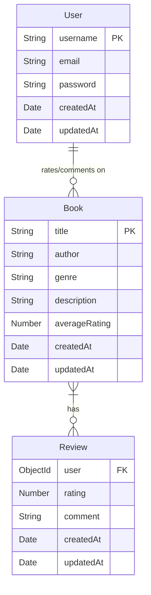

-----

### Explanation of the ER Diagram:

  * **Entities:**

      * **User:** Represents individual users with attributes like `username`, `email`, `password`, `createdAt`, and `updatedAt`. `username` is designated as the primary key (PK).
      * **Book:** Represents books with attributes such as `title`, `author`, `genre`, `description`, `averageRating`, `createdAt`, and `updatedAt`. `title` is designated as the primary key (PK), assuming titles are unique enough for this purpose or a unique book ID would be implied.
      * **Review:** This is an **associative entity** (or a weak entity depending on how you model it, but here it's stronger as it has its own attributes like `rating` and `comment`). It connects a `User` to a `Book` and contains specific information about a user's review for a particular book. It has its own `createdAt` and `updatedAt` attributes.

  * **Relationships:**

      * **User rates/comments on Book (1-to-Many):**
          * A single `User` can rate/comment on multiple `Book`s.
          * A `Book` can be rated/commented on by many `User`s.
          * This many-to-many relationship is resolved by the `Review` entity.

  * **Attributes:**

      * **PK (Primary Key):** Uniquely identifies each record in an entity (e.g., `username` for `User`, `title` for `Book`).
      * **FK (Foreign Key):** An attribute in one entity that refers to the primary key of another entity, establishing a link between them (e.g., `user` in `Review` is a foreign key referencing the `_id` or `username` of the `User` entity, and implicitly a book ID would be needed in Review as well, referring to the `Book` entity).

